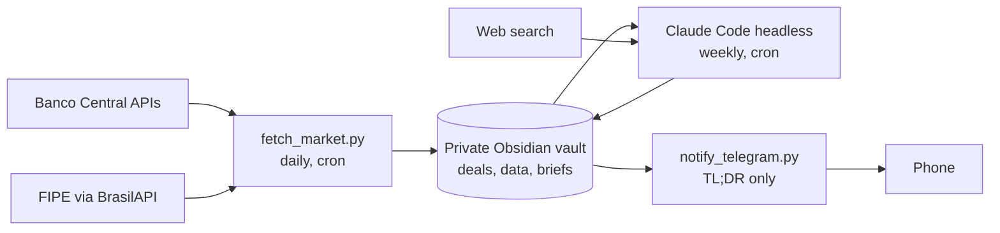

# vault-market-agent

A self-hosted market-intelligence agent for a small used-vehicle and real estate business in Uberlândia, Brazil. It collects official economic and pricing data every day, has Claude Code write a weekly analysis into an Obsidian vault, and sends a privacy-safe summary to Telegram.

Built to run on a home server on a regular Claude Pro subscription, with no paid APIs.

## What it does

- **Daily:** pulls the Selic rate, IPCA inflation, the average auto-loan rate and the Focus survey from the Banco Central's open APIs, plus FIPE reference prices for tracked vehicles. No LLM involved.
- **Weekly:** Claude Code (headless) reads the fresh data, the open deals and the owner's market hypotheses, researches the past week's news, and writes a brief with recommendations. It suggests; the owner decides.
- **Feedback loop:** every closed deal records days to sell, price changes and lead sources, so later briefs are grounded in real outcomes instead of asking prices.

## Architecture



Deterministic data collection is separate from LLM reasoning: the daily job is free and reproducible, and the model only runs where judgment is needed.

## Privacy design

The business data never touches this repository or GitHub.

| Data | Where it lives |
|---|---|
| Code, prompts, templates, fictional example | This public repo |
| Deal notes, costs, margins, briefs, watchlist | Private vault on the owner's machines, synced with Syncthing (no cloud) |
| Vault path, Telegram token | `.env`, gitignored |
| What reaches Telegram | Only the brief's TL;DR, which the prompt forbids from containing costs, margins or prices |

Other guardrails: the headless agent gets file tools only (no shell), it may not edit deal notes, every number it writes needs a source, and portal scraping is explicitly disallowed by its rules.

## Repository layout

```
scripts/
  common.py            .env loading, vault path
  fetch_market.py      daily data collector (stdlib only)
  notify_telegram.py   sends the TL;DR (stdlib only)
  weekly_brief.sh      fetch -> Claude Code -> local commit -> Telegram
prompts/
  weekly_brief.md      instructions for the weekly analysis
vault-template/
  Business/            folder to copy into the vault (rules, templates)
examples/
  example-deal.md      fictional deal showing the note format
tests/                 offline unit tests
```

## Setup (home server, Linux)

### 1. Install the basics
```bash
sudo apt install -y git python3 tmux
curl -fsSL https://claude.ai/install.sh | bash
claude --version
```
Run `claude` once and log in with your Claude account. If the server has no browser, open the login link it shows on another device.

Check the server's timezone so the schedule runs at the right hour:
```bash
timedatectl            # if needed: sudo timedatectl set-timezone America/Sao_Paulo
```

### 2. Clone and configure
```bash
git clone https://github.com/<you>/vault-market-agent.git ~/vault-market-agent
cd ~/vault-market-agent
cp .env.example .env
nano .env              # set VAULT_DIR and CLAUDE_BIN (run: which claude)
```

### 3. Sync the vault to the server with Syncthing
Install Syncthing on both the laptop and the server, then keep it running on the server after you log out:
```bash
sudo apt install -y syncthing
systemctl --user enable --now syncthing
sudo loginctl enable-linger "$USER"
```
The web UI listens only on the server itself. From the laptop, open a tunnel and browse to http://localhost:8385:
```bash
ssh -L 8385:localhost:8384 user@homelab
```
Add each device in the other's UI, then share the vault folder from the laptop.

### 4. Prepare the vault
On the laptop (Syncthing copies it to the server):
1. Copy `vault-template/Business/` into the vault root.
2. Add to the vault's root `CLAUDE.md`: `For anything in Business/, read Business/_rules.md first and follow it.`
3. Copy `Business/Market/watchlist.example.json` to `watchlist.json` and add your vehicles' FIPE codes.
4. Optional but recommended, local history with no remote:
   ```bash
   cd /path/to/vault && git init && git add -A && git commit -m "initial"
   ```
   Never add a remote to the vault repository.

### 5. Telegram notifications (optional)
1. In Telegram, message @BotFather, send `/newbot`, and copy the token into `.env` as `TELEGRAM_BOT_TOKEN`.
2. Send any message to your new bot, then on the server:
   ```bash
   curl -s "https://api.telegram.org/bot$(grep TELEGRAM_BOT_TOKEN .env | cut -d= -f2)/getUpdates"
   ```
   Copy the number after `"chat":{"id":` into `.env` as `TELEGRAM_CHAT_ID`.
3. Test: `python3 scripts/notify_telegram.py --test`

### 6. Test each piece by hand
```bash
python3 scripts/fetch_market.py        # then open Business/Market/data/latest.md
./scripts/weekly_brief.sh              # then open the new file in Business/Briefs/
```

### 7. Schedule
`crontab -e` and add (adjust the paths):
```
0 7 * * *  /usr/bin/python3 /home/USER/vault-market-agent/scripts/fetch_market.py >> /home/USER/vault-market-agent/fetch.log 2>&1
0 8 * * 1  /home/USER/vault-market-agent/scripts/weekly_brief.sh >> /home/USER/vault-market-agent/brief.log 2>&1
```

### 8. Phone access to the agent
Start a persistent Claude Code session in the vault inside tmux, and connect to it from the Claude mobile app:
```bash
tmux new -s agent
cd /path/to/vault && claude remote-control
# detach with Ctrl+b then d; reattach with: tmux attach -t agent
```

## Tests
```bash
python3 -m unittest discover -s tests -v
```
The tests run offline. CI runs them on every push.

## Limitations
- FIPE prices come through BrasilAPI, a community project, so availability depends on it.
- Market data is national; local signal comes from the owner's own deal logs, which take time to accumulate.
- The headless run uses the owner's Claude subscription usage.

## License
MIT
