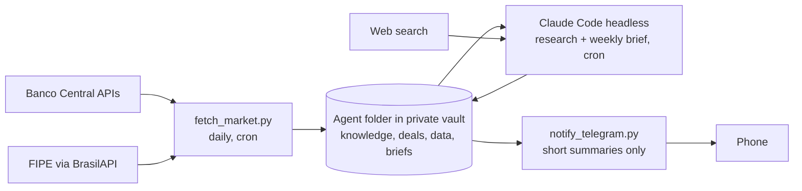

# vault-market-agent

A self-hosted market-intelligence agent for a small used-vehicle and real estate business in Uberlândia, Brazil. It collects official economic and pricing data every day, has Claude Code write a weekly analysis into an Obsidian vault, and sends a privacy-safe summary to Telegram.

Built to run on a home server on a regular Claude Pro subscription, with no paid APIs.

## What it does

- **Daily:** pulls the Selic rate, IPCA inflation, the average auto-loan rate and the Focus survey from the Banco Central's open APIs, plus FIPE reference prices for tracked vehicles. No LLM involved.
- **Research (a few times a week):** Claude Code researches the topics the business depends on (vehicle documentation, reseller tax rules, credit, the local market, pricing, sales channels, and more) and maintains a sourced knowledge base. It picks what to research next on its own, so the knowledge does not depend on the owner feeding it.
- **Weekly:** Claude Code reads the fresh data, the knowledge base, the open deals and the owner's market hypotheses, researches the past week's news, and writes a brief with recommendations. It suggests; the owner decides.
- **Feedback loop:** every closed deal records days to sell, price changes and lead sources, so later briefs are grounded in real outcomes instead of asking prices.

## Architecture



Deterministic data collection is separate from LLM reasoning: the daily job is free and reproducible, and the model only runs where judgment is needed.

## Privacy design

The business data never touches this repository or GitHub.

| Data | Where it lives |
|---|---|
| Code, prompts, templates, fictional example | This public repo |
| Deal notes, costs, margins, briefs, watchlist | Private vault on the owner's machines, synced with Syncthing (no cloud) |
| Vault path, Telegram token | `.env`, gitignored |
| What reaches Telegram | Only the brief's TL;DR and the research log entry, which the prompts forbid from containing costs, margins or prices |

### Agent permissions

The agent's limits are enforced by Claude Code's permission system, not just asked for in the prompt. `scripts/run_agent.sh` starts the agent inside its folder in the vault and loads `config/agent-settings.json`, which:

- blocks every file read outside that folder (`blockReadsOutsideWorkingDirectories`), so the rest of the vault, including personal finance notes, is invisible to it;
- denies all shell commands;
- denies edits to the owner's deal notes, templates, the data files and the agent's own rules.

The settings file lives in this repository, outside the vault, so the agent cannot edit its own limits. Every source is cited, and portal scraping is disallowed by its rules.

## Repository layout

```
scripts/
  common.py            .env loading, vault and agent folder paths
  fetch_market.py      daily data collector (stdlib only)
  notify_telegram.py   sends short summaries (stdlib only)
  run_agent.sh         runs a job (research | brief) with scoped permissions
config/
  agent-settings.json  Claude Code permission limits for the agent
prompts/
  research.md          instructions for a research session
  brief.md             instructions for the weekly brief
vault-template/
  agent/               folder to copy into the vault (rules, knowledge index, templates)
examples/
  example-deal.md      fictional deal showing the note format
tests/                 offline unit tests
```

## Setup (home server, Linux)

### 1. Install the basics
```bash
sudo apt install -y git python3 tmux
curl -fsSL https://claude.ai/install.sh | bash
claude --version
```
Run `claude` once and log in with your Claude account. If the server has no browser, open the login link it shows on another device.

Check the server's timezone so the schedule runs at the right hour:
```bash
timedatectl            # if needed: sudo timedatectl set-timezone America/Sao_Paulo
```

### 2. Clone and configure
```bash
git clone https://github.com/<you>/vault-market-agent.git ~/vault-market-agent
cd ~/vault-market-agent
cp .env.example .env
nano .env              # set VAULT_DIR, AGENT_DIR and CLAUDE_BIN (run: which claude)
```

### 3. Sync the vault to the server with Syncthing
Install Syncthing on both the laptop and the server, then keep it running on the server after you log out:
```bash
sudo apt install -y syncthing
systemctl --user enable --now syncthing
sudo loginctl enable-linger "$USER"
```
The web UI listens only on the server itself. From the laptop, open a tunnel and browse to http://localhost:8385:
```bash
ssh -L 8385:localhost:8384 user@homelab
```
Add each device in the other's UI, then share the vault folder from the laptop.

### 4. Prepare the vault
On the laptop (Syncthing copies it to the server):
1. Copy `vault-template/agent/` into the vault and rename it to your `AGENT_DIR` (default `Business`).
2. Copy `Market/watchlist.example.json` to `Market/watchlist.json` inside it, and add your vehicles' FIPE codes when you have some.
3. Optional but recommended, local history with no remote:
   ```bash
   cd /path/to/vault && git init && git add -A && git commit -m "initial"
   ```
   Never add a remote to the vault repository.

### 5. Telegram notifications (optional)
1. In Telegram, message @BotFather, send `/newbot`, and copy the token into `.env` as `TELEGRAM_BOT_TOKEN`.
2. Send any message to your new bot, then on the server:
   ```bash
   curl -s "https://api.telegram.org/bot$(grep TELEGRAM_BOT_TOKEN .env | cut -d= -f2)/getUpdates"
   ```
   Copy the number after `"chat":{"id":` into `.env` as `TELEGRAM_CHAT_ID`.
3. Test: `python3 scripts/notify_telegram.py --test`

### 6. Test each piece by hand
```bash
python3 scripts/fetch_market.py        # then open Market/data/latest.md in the agent folder
./scripts/run_agent.sh research        # then open Knowledge/ and Research/log.md
./scripts/run_agent.sh brief           # then open the new file in Briefs/
```
Each run writes its full output to `.last_<job>.log` in the agent folder.

### 7. Schedule
`crontab -e` and add (adjust the paths):
```
# daily data, 07:00
0 7 * * *    /usr/bin/python3 /home/USER/vault-market-agent/scripts/fetch_market.py >> /home/USER/vault-market-agent/fetch.log 2>&1
# research, Tue/Thu/Sat 06:00
0 6 * * 2,4,6 /home/USER/vault-market-agent/scripts/run_agent.sh research >> /home/USER/vault-market-agent/research.log 2>&1
# weekly brief, Monday 08:00
0 8 * * 1    /home/USER/vault-market-agent/scripts/run_agent.sh brief >> /home/USER/vault-market-agent/brief.log 2>&1
```
Each research run covers up to two topics, so the initial knowledge base fills in about two weeks; after that the runs keep it current.

### 8. Phone access to the agent
Start a persistent Claude Code session in the agent folder inside tmux, and connect to it from the Claude mobile app:
```bash
tmux new -s agent
cd /path/to/vault/Business && claude remote-control
# detach with Ctrl+b then d; reattach with: tmux attach -t agent
```

## Tests
```bash
python3 -m unittest discover -s tests -v
```
The tests run offline. CI runs them on every push.

## Limitations
- FIPE prices come through BrasilAPI, a community project, so availability depends on it.
- Market data is national; local signal comes from the owner's own deal logs, which take time to accumulate.
- The headless runs use the owner's Claude subscription usage; three research runs and one brief per week is a light load, but heavy interactive use the same day can hit the plan's limits.
- Interactive sessions (such as Remote Control) don't load `config/agent-settings.json`, so Claude asks before reading outside the folder; answer those prompts with care.

## License
MIT
