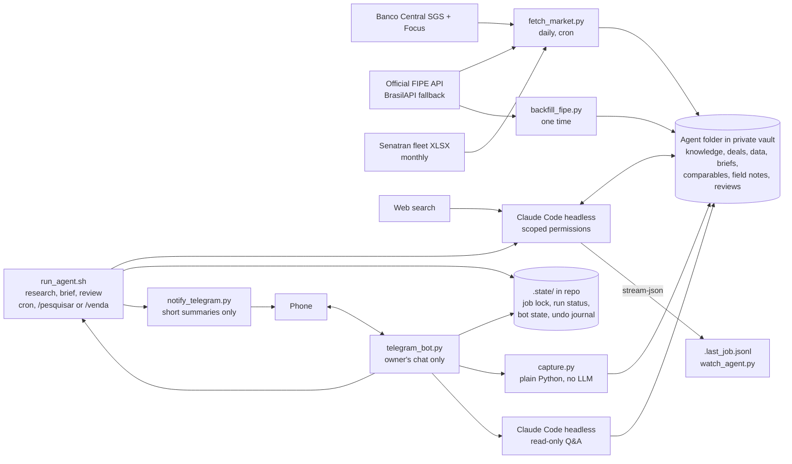

# vault-market-agent

A self-hosted market-intelligence agent for a small used-vehicle and real estate business in Uberlândia, Brazil. It collects official economic and pricing data every day, has Claude Code write a weekly analysis into an Obsidian vault, and sends a privacy-safe summary to Telegram. A Telegram bot lets the owner check on the agent, ask it questions, and log local market observations and the outcome of each sale from the phone. Everything the agent writes for the owner is in Brazilian Portuguese; the code and docs are in English.

Built to run on a home server on a regular Claude Pro subscription, with no paid APIs.

## What it does

- **Daily:** pulls the Selic rate, IPCA inflation, the auto-loan rate, new auto loans and the auto-loan default rate from Banco Central, the Focus survey, FIPE prices for tracked vehicles and for a basket of 20 popular used models, and Uberlândia's vehicle fleet from Senatran (monthly). No LLM involved. See "Data sources" below.
- **Field data from the phone:** `/comp`, `/lead`, `/preco`, `/venda` and `/nota` in Telegram write comparables, leads, price changes, sales and field notes straight into the vault. Plain Python, no Claude usage; `/desfazer` undoes the last one. `/oportunidades` lists local listings priced well below comparable ones and opens the one you pick.
- **Research (a few times a week):** Claude Code researches the topics the business depends on (vehicle documentation, reseller tax rules, credit, the local market, pricing, sales channels, and more) and maintains a sourced knowledge base. It picks what to research next on its own, so the knowledge does not depend on the owner feeding it.
- **Weekly:** Claude Code reads the fresh data, the knowledge base, the open deals and the owner's market hypotheses, researches the past week's news, and writes a brief with recommendations. It suggests; the owner decides.
- **Learning from each sale:** after `/venda` (and daily as a safety net) a review job compares what was planned and predicted with what happened, writes `Reviews/<deal>.md`, and keeps `Knowledge/playbook.md`, a list of rules learned from real sales with how many deals support each. Briefs and answers weigh this local data above general market data.
- **On demand:** a Telegram bot reports what the agent is doing, starts a research run, and answers questions from the knowledge base, the market data and the deals, read-only.

## Architecture



Deterministic data collection is separate from LLM reasoning: the daily job and the phone captures are free and reproducible, and the model only runs where judgment is needed. A lock in `.state/` makes sure only one agent job (research, brief or review) runs at a time.

## Privacy design

The business data never touches this repository or GitHub.

| Data | Where it lives |
|---|---|
| Code, prompts, templates, fictional example | This public repo |
| Deal notes, costs, margins, briefs, watchlist | Private vault on the owner's machines, synced with Syncthing (no cloud) |
| Vault path, Telegram token | `.env`, gitignored |
| Captured comparables, field notes, leads, price changes and sales | Private vault: `Market/comparables.csv`, `Market/field-notes.md` and the deal notes |
| Local marketplace listings typed in Obsidian | Private vault: `Market/listings.md` |
| Sale reviews and the playbook | Private vault: `Reviews/`, `Knowledge/playbook.md` |
| Job lock, run status, bot offset and rate-limit counters | `.state/` in the repo folder on the server, gitignored |
| Undo journal of the last 20 captures | `.state/captures.json` on the server, gitignored. It holds the previous content of each file a capture changed, deal notes included, so `/desfazer` can restore it exactly |
| What reaches Telegram automatically | Only the brief's `Resumo` and the research log entry (the prompts forbid both from containing costs, margins or prices), plus the file names of new sale reviews |
| Bot replies | Status, the same sections, captured values echoed back, and answers to the owner's questions. Answers include purchase prices, costs, margins or profits from `Deals/` only when the question explicitly asks for those numbers. This rule lives in `prompts/question.md`, so it is enforced by the prompt, not by permissions |

**Telegram is not end-to-end encrypted.** Prices and other details you send with `/comp`, `/lead`, `/preco` and `/venda` pass through Telegram's servers, and the bot echoes them back so you can spot typos. If that is not acceptable for a number, type it in the deal note in Obsidian instead.

### Agent permissions

The agent's limits are enforced by Claude Code's permission system, not just asked for in the prompt. `scripts/run_agent.sh` starts the agent inside its folder in the vault and loads `config/agent-settings.json`, which:

- blocks every file read outside that folder (`blockReadsOutsideWorkingDirectories`), so the rest of the vault, including personal finance notes, is invisible to it;
- denies all shell commands;
- denies edits to the owner's deal notes, templates, the data files, the captured comparables, the owner's listings and field notes (`Market/comparables.csv`, `Market/listings.md`, `Market/field-notes.md`, which it can still read) and the agent's own rules.

It can create and edit `Knowledge/` (including `playbook.md`), `Reviews/` and `Briefs/`, and add evidence rows to `Market/hypotheses.md`.

The settings file lives in this repository, outside the vault, so the agent cannot edit its own limits. Every source is cited, and portal scraping is disallowed by its rules. The settings also set `"language": "portuguese"`.

The bot's questions run with the same settings file and folder, plus `--permission-mode dontAsk`, only read and search tools allowed, and `Edit`, `Write`, `NotebookEdit` and `Bash` explicitly denied, so a question can never change a file. The question is passed on stdin, never through a shell or as a command-line argument, and the Telegram token is removed from Claude's environment.

## Repository layout

```
scripts/
  common.py               .env loading, vault and agent folder paths
  fetch_market.py         daily data collector (Banco Central, FIPE, Senatran)
  fipe.py                 official FIPE API client, basket and FIPE history helpers
  backfill_fipe.py        one-time load of 24 months of FIPE values for the basket
  fetch_fleet.py          monthly Uberlândia fleet by vehicle type from Senatran
  capture.py              field-data captures from Telegram, atomic writes, undo journal
  deals.py                deal-note helpers: matching, frontmatter, open deals, pending reviews
  notify_telegram.py      sends short summaries
  run_agent.sh            runs a job (research | brief | review) with scoped permissions, one at a time
  watch_agent.py          follows a running job live, one line per step
  status.py               shows the running job and the last run of each job
  telegram_bot.py         Telegram bot: status, research on demand, captures, read-only questions
  install_bot_service.sh  installs the bot as a systemd user service
deploy/
  vault-agent-bot.service systemd user unit template for the bot
config/
  agent-settings.json     Claude Code permission limits and language for the agent
  fipe-basket.json        20 popular used models (verified FIPE codes) tracked every month
prompts/                  in Portuguese, because the agent writes for the owner
  research.md             instructions for a research session, with the required topics
  brief.md                instructions for the weekly brief
  question.md             instructions for answering a question from Telegram
  review.md               instructions for reviewing a sold deal and updating the playbook
vault-template/
  agent/               folder to copy into the vault (rules, knowledge index, templates)
examples/
  example-deal.md      fictional deal showing the note format
tests/                    offline unit tests; fixtures/ holds saved answers of each data source
```
All Python is standard library only.

## Setup (home server, Linux)

### 1. Install the basics
```bash
sudo apt install -y git python3 tmux
curl -fsSL https://claude.ai/install.sh | bash
claude --version
```
Run `claude` once and log in with your Claude account. If the server has no browser, open the login link it shows on another device.

Check the server's timezone so the schedule runs at the right hour:
```bash
timedatectl            # if needed: sudo timedatectl set-timezone America/Sao_Paulo
```

### 2. Clone and configure
```bash
git clone https://github.com/<you>/vault-market-agent.git ~/vault-market-agent
cd ~/vault-market-agent
cp .env.example .env
nano .env              # set VAULT_DIR, AGENT_DIR and CLAUDE_BIN (run: which claude)
```

### 3. Sync the vault to the server with Syncthing
Install Syncthing on both the laptop and the server, then keep it running on the server after you log out:
```bash
sudo apt install -y syncthing
systemctl --user enable --now syncthing
sudo loginctl enable-linger "$USER"
```
The web UI listens only on the server itself. From the laptop, open a tunnel and browse to http://localhost:8385:
```bash
ssh -L 8385:localhost:8384 user@homelab
```
Add each device in the other's UI, then share the vault folder from the laptop.

### 4. Prepare the vault
On the laptop (Syncthing copies it to the server):
1. Copy `vault-template/agent/` into the vault and rename it to your `AGENT_DIR` (default `Business`).
2. Copy `Market/watchlist.example.json` to `Market/watchlist.json` inside it, and add your vehicles' FIPE codes when you have some. The basket of popular models in `config/fipe-basket.json` is tracked anyway.
3. Optional but recommended, local history with no remote:
   ```bash
   cd /path/to/vault && git init && git add -A && git commit -m "initial"
   ```
   Never add a remote to the vault repository.

### 5. Telegram (optional)
Create the bot once; it is used both for notifications and for the bot service in step 9.
1. In Telegram, open a chat with @BotFather, send `/newbot`, and choose a name and a username ending in `bot`. BotFather replies with a token: put it in `.env` as `TELEGRAM_BOT_TOKEN`. Anyone with the token controls the bot, so keep it only in `.env`.
2. Find your chat ID. Send any message to your new bot, then on the server (before the bot service is running, since only one program can poll at a time):
   ```bash
   curl -s "https://api.telegram.org/bot$(grep TELEGRAM_BOT_TOKEN .env | cut -d= -f2)/getUpdates"
   ```
   Copy the number after `"chat":{"id":` into `.env` as `TELEGRAM_CHAT_ID`. The bot answers only this chat.
3. Optional: in @BotFather, `/setcommands` and paste the command list from the Telegram bot section below, so Telegram suggests them.
4. Test: `python3 scripts/notify_telegram.py --test`

### 6. Test each piece by hand
```bash
python3 scripts/fetch_market.py        # then open Market/data/latest.md in the agent folder
python3 scripts/backfill_fipe.py       # one time, 30-60 min: 24 months of FIPE values for the basket
./scripts/run_agent.sh research        # then open Knowledge/ and Research/log.md
./scripts/run_agent.sh brief           # then open the new file in Briefs/
./scripts/run_agent.sh review          # "nothing to do" until a deal is marked sold
```
Each run writes Claude's full event stream to `.last_<job>.jsonl` and a short summary with the final answer to `.last_<job>.log`, both in the agent folder. See "Watch a run live" below.

### 7. Schedule
`crontab -e` and add (adjust the paths):
```
# daily data, 07:00, then review any sold deal still without a review (no usage when there is none)
0 7 * * *    /usr/bin/python3 /home/USER/vault-market-agent/scripts/fetch_market.py >> /home/USER/vault-market-agent/fetch.log 2>&1; /home/USER/vault-market-agent/scripts/run_agent.sh review >> /home/USER/vault-market-agent/review.log 2>&1
# research, Tue/Thu/Sat 06:00
0 6 * * 2,4,6 /home/USER/vault-market-agent/scripts/run_agent.sh research >> /home/USER/vault-market-agent/research.log 2>&1
# weekly brief, Monday 08:00
0 8 * * 1    /home/USER/vault-market-agent/scripts/run_agent.sh brief >> /home/USER/vault-market-agent/brief.log 2>&1
```
Each research run covers up to two topics, so the initial knowledge base fills in about two weeks; after that the runs keep it current. The review normally runs right after `/venda`; the daily line is a safety net for sales typed into a note by hand or for a review that failed. If two jobs overlap (or you start one from Telegram), the second waits for the first, up to 30 minutes, then gives up with exit code 75 and a Telegram notice.

### 8. Phone access to the agent
Start a persistent Claude Code session in the agent folder inside tmux, and connect to it from the Claude mobile app:
```bash
tmux new -s agent
cd /path/to/vault/Business && claude remote-control
# detach with Ctrl+b then d; reattach with: tmux attach -t agent
```

### 9. Install the bot service (optional)
After step 5, run the bot as a systemd user service so it starts on boot and restarts if it crashes:
```bash
./scripts/install_bot_service.sh
systemctl --user status vault-agent-bot        # should be "active (running)"
journalctl --user -u vault-agent-bot -f        # live log
```
The script fills in this repo's path in `deploy/vault-agent-bot.service`, installs it into `~/.config/systemd/user/` and enables it. It needs user lingering (`sudo loginctl enable-linger "$USER"`, done in step 3) to keep running after you log out. Run it again after `git pull` to restart the bot with the new code. If `.env` is missing the token or chat ID, the bot exits with code 78 and systemd does not restart it; fix `.env` and run `systemctl --user restart vault-agent-bot`.

## Watch a run live
```bash
python3 scripts/status.py                      # is a job running? when did each job last run, and how did it go?
python3 scripts/watch_agent.py                 # follow the newest run, like tail -f
python3 scripts/watch_agent.py --job brief     # follow a specific job
```
`watch_agent.py` prints one line per step: each tool with its target (the file it reads or edits, the search query, the URL it fetches), errors such as blocked permissions, and the final result. If the run already finished, it replays it. It exits when the result arrives, or on Ctrl+C. It reads the `.last_<job>.jsonl` file in the agent folder, so you can also run it on the laptop once Syncthing has copied the file.

## Telegram bot
`scripts/telegram_bot.py` long-polls Telegram (no open ports) and replies only to `TELEGRAM_CHAT_ID`. Messages from any other chat are ignored without a reply, and only their count is logged. Replies are in Portuguese:

```
status - trabalho em execução e a última execução de cada um
ultimo - a entrada mais recente do log de pesquisa
resumo - o Resumo do brief semanal mais recente
pesquisar - começar uma sessão de pesquisa agora
negocios - negócios ativos e dias anunciados
comp - registrar um anúncio comparável
lead - registrar um contato num negócio
preco - registrar uma mudança de preço
venda - marcar um negócio como vendido
nota - registrar uma nota de campo
desfazer - desfazer a última captura
ajuda - lista de comandos
```

Any other message is a question. The agent answers it (under 300 words, with sources) from `Knowledge/`, `Market/data/` and `Deals/`, searching the web if needed, and says when it doesn't know. While it works, Telegram shows "typing...". Questions are answered one at a time; if one takes more than 10 minutes, it is stopped and you get an error reply. At most `BOT_MAX_QUESTIONS_PER_HOUR` questions (default 20) are answered per hour, so a runaway loop can't drain your Claude usage. `/pesquisar` runs the same `run_agent.sh research` as cron, respecting the job lock, and replies with the log entry when it finishes.

### Capturing field data
Fields are separated by `;`, so model names can have spaces; fields in `[ ]` are optional. Numbers take the usual Brazilian forms: `72900`, `72.900`, `72,9k`, `72,9 mil`, `R$ 72.900,00`, and km also `65mil` or `65k`. Ambiguous input such as `72,9` without `k` is refused with a hint instead of guessed. The bot replies with the parsed values so you can spot mistakes, and reminds you that `/desfazer` undoes the capture.

| Command | Example | Writes |
|---|---|---|
| `/comp modelo ; ano ; km ; preço ; canal ; [obs]` | `/comp Onix LT 1.0 ; 2019 ; 65mil ; 72,9k ; OLX ; único dono` | a row in `Market/comparables.csv` (created with a header on first use) |
| `/lead negócio ; canal ; tipo ; [valor da oferta] ; [obs]` | `/lead onix-2019 ; Marketplace ; oferta ; 68 mil ; quer pagar à vista` | a row in the deal's `Registro de contatos` table; `tipo` is `pergunta`, `visita` or `oferta` |
| `/preco negócio ; novo preço ; motivo` | `/preco onix-2019 ; 71.500 ; dia 15 sem visitas` | a row in the deal's `Histórico de preço` table |
| `/venda negócio ; preço final ; canal ; [data]` | `/venda onix-2019 ; R$ 70.000,00 ; OLX ; 02/10/2026` | `status: sold`, `sold_price`, `sold_on` (default today) and `sale_channel` in the deal's frontmatter, then starts the review job |
| `/nota texto` | `/nota Leilão de sexta teve muitos Onix 2019 com sinistro` | a dated line in `Market/field-notes.md` |
| `/negocios` | | lists deals that are not `sold` or `dropped`, with days listed |
| `/desfazer` | | restores the file changed by the most recent capture, exactly as it was |
| `/oportunidades` | | read-only: lists up to 10 listings from the last 30 days priced more than 15% below at least 2 others of the same model (model year ±2); tapping a number shows that listing with a button that opens it |

`negócio` is matched against the note file names in `Deals/`, ignoring case, accents and `-`/`_`/spaces (`onix 2019` finds `Ônix-2019.md`). If it matches no note or several, nothing is written and the bot lists the candidates. A deal note missing the leads or price table gets it added at the template's position. Every write goes to a temporary file that then replaces the original, changes nothing else in the file, and is committed to the vault's local git repo (if there is one) as `capture: <command>`. `/desfazer` works on the last 20 captures, newest first, and refuses if the file was changed after the capture (for example in Obsidian), so it never overwrites your edits.

The agent can read the captured files but its settings deny editing `Market/comparables.csv` and `Market/field-notes.md`; deal notes were already off limits.

For many listings at once, type them in Obsidian instead: `Market/listings.md` is a table with the same fields as `/comp` (date, model, year, km, price, channel, note). The agent reads both sources together and treats them as asking prices; its settings deny editing this file too. `/oportunidades` (`scripts/opportunities.py`) uses the same two sources without counting a car twice. It leaves out prices under R$ 5.000, over R$ 300.000 or under 40% of the comparable average, and rows whose Obs says `vendido` or `saiu do ar`. To open a listing from Telegram, put its link in Obs: the full URL, or `fb:` plus the Marketplace listing number.

## Data sources
All free and official; each was checked before use, and the tests parse answers saved from each one.

| Source | What | How often |
|---|---|---|
| Banco Central SGS 432, 433, 20749 | Selic target, IPCA monthly, average auto-loan rate for individuals | daily |
| Banco Central SGS [20673](https://dadosabertos.bcb.gov.br/dataset/20673-concessoes-de-credito-com-recursos-livres---pessoas-fisicas---aquisicao-de-veiculos) | New auto loans to individuals (R$ million per month) | daily (monthly series) |
| Banco Central SGS [21121](https://dadosabertos.bcb.gov.br/dataset/21121-inadimplencia-da-carteira-de-credito-com-recursos-livres---pessoas-fisicas---aquisicao-de-vei) | Default rate (over 90 days) on auto loans to individuals | daily (monthly series) |
| Banco Central Focus | Median Selic expectation, this year and next | daily |
| Official FIPE API (`veiculos.fipe.org.br`), BrasilAPI as fallback | Watchlist vehicles; the 20-model basket in `config/fipe-basket.json` | watchlist daily; basket once per FIPE month |
| Senatran "Frota por Município e Tipo" (XLSX) | Uberlândia's (IBGE 3170206) registered vehicles by type | checked daily until the new month appears |

Monthly series are fetched with 13 points, so `Market/data/latest.md` shows each one's change over 3 and 12 months, and the brief prompt asks the agent for trends, not just the latest value. Basket values go to `Market/data/fipe_history.csv` (one row per model year and FIPE month); `scripts/backfill_fipe.py` loads the previous 24 months once, so depreciation curves exist from day one. It can be stopped and run again and continues where it left off. The fleet goes to `Market/data/fleet.csv`; the first run also loads the same month a year earlier for a 12-month change.

## Learning from each sale
`./scripts/run_agent.sh review` looks for deals with `status: sold` that have no `Reviews/<deal>.md`. With none it prints "nothing to do" and exits before taking the lock, so it costs no usage. Otherwise it runs the agent once per deal with `prompts/review.md`: compare the pricing plan, the briefs that mentioned the deal and the comparables at the time with the final price, days to sell, channel, leads and price changes; write `Reviews/<deal>.md` with what worked, what didn't and concrete lessons; and update `Knowledge/playbook.md`, where each rule shows how many sold deals support it and stays `preliminar` until at least 10 do. `/venda` starts it right away (respecting the job lock) and the bot replies with the review's file name when it is done; cron runs it daily as a safety net.

## Tests
```bash
python3 -m unittest discover -s tests -v
```
The tests run offline. CI runs them on every push.

## Limitations
- FIPE prices come from the JSON API behind FIPE's own website. It is public but not formally documented and answers "too many requests" when called fast, so calls are spaced (about 1.5 s) and retried; if FIPE changes it, the errors show up in `latest.md`, and the watchlist falls back to BrasilAPI (a community project, which was down when this was written).
- Senatran publishes the fleet one to two months late, only as XLSX, and renames the files from month to month; the link matcher covers every name seen on the 2025 and 2026 pages, and a miss shows up as a fetch error.
- Market data is mostly national; local signal comes from the owner's captures and deal logs, which take time to accumulate. Playbook rules stay preliminary until 10 sold deals support them.
- Captures use the server's date; `/venda` accepts an explicit date for a sale recorded later.
- The headless runs use the owner's Claude subscription usage; three research runs and one brief per week is a light load, but heavy interactive use the same day can hit the plan's limits.
- Interactive sessions (such as Remote Control) don't load `config/agent-settings.json`, so Claude asks before reading outside the folder; answer those prompts with care.
- Bot questions use the same subscription. They don't take the job lock (they only read), so a question can run during a research run.
- Each question starts a fresh session: the bot doesn't remember earlier questions.
- Restarting the bot service stops a research run started with `/pesquisar` or a review started by `/venda`, because systemd stops everything the service started. A stopped review is picked up by the next daily review run.
- Older notes written in English are translated by the research runs as they get updated, not all at once.

## License
MIT
