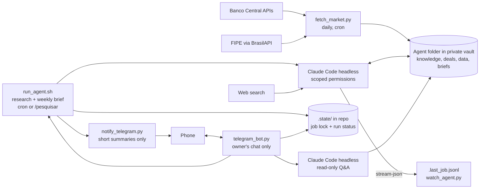

# vault-market-agent

A self-hosted market-intelligence agent for a small used-vehicle and real estate business in Uberlândia, Brazil. It collects official economic and pricing data every day, has Claude Code write a weekly analysis into an Obsidian vault, and sends a privacy-safe summary to Telegram. A Telegram bot lets the owner check on the agent and ask it questions from the phone. Everything the agent writes for the owner is in Brazilian Portuguese; the code and docs are in English.

Built to run on a home server on a regular Claude Pro subscription, with no paid APIs.

## What it does

- **Daily:** pulls the Selic rate, IPCA inflation, the average auto-loan rate and the Focus survey from the Banco Central's open APIs, plus FIPE reference prices for tracked vehicles. No LLM involved.
- **Research (a few times a week):** Claude Code researches the topics the business depends on (vehicle documentation, reseller tax rules, credit, the local market, pricing, sales channels, and more) and maintains a sourced knowledge base. It picks what to research next on its own, so the knowledge does not depend on the owner feeding it.
- **Weekly:** Claude Code reads the fresh data, the knowledge base, the open deals and the owner's market hypotheses, researches the past week's news, and writes a brief with recommendations. It suggests; the owner decides.
- **Feedback loop:** every closed deal records days to sell, price changes and lead sources, so later briefs are grounded in real outcomes instead of asking prices.
- **On demand:** a Telegram bot reports what the agent is doing, starts a research run, and answers questions from the knowledge base, the market data and the deals, read-only.

## Architecture



Deterministic data collection is separate from LLM reasoning: the daily job is free and reproducible, and the model only runs where judgment is needed. A lock in `.state/` makes sure only one agent job (research or brief) runs at a time.

## Privacy design

The business data never touches this repository or GitHub.

| Data | Where it lives |
|---|---|
| Code, prompts, templates, fictional example | This public repo |
| Deal notes, costs, margins, briefs, watchlist | Private vault on the owner's machines, synced with Syncthing (no cloud) |
| Vault path, Telegram token | `.env`, gitignored |
| Job lock, run status, bot offset and rate-limit counters | `.state/` in the repo folder on the server, gitignored |
| What reaches Telegram automatically | Only the brief's `Resumo` and the research log entry, which the prompts forbid from containing costs, margins or prices |
| Bot replies | Status, the same two sections, and answers to the owner's questions. Answers include purchase prices, costs, margins or profits from `Deals/` only when the question explicitly asks for those numbers. This rule lives in `prompts/question.md`, so it is enforced by the prompt, not by permissions; Telegram chats are not end-to-end encrypted |

### Agent permissions

The agent's limits are enforced by Claude Code's permission system, not just asked for in the prompt. `scripts/run_agent.sh` starts the agent inside its folder in the vault and loads `config/agent-settings.json`, which:

- blocks every file read outside that folder (`blockReadsOutsideWorkingDirectories`), so the rest of the vault, including personal finance notes, is invisible to it;
- denies all shell commands;
- denies edits to the owner's deal notes, templates, the data files and the agent's own rules.

The settings file lives in this repository, outside the vault, so the agent cannot edit its own limits. Every source is cited, and portal scraping is disallowed by its rules. The settings also set `"language": "portuguese"`.

The bot's questions run with the same settings file and folder, plus `--permission-mode dontAsk`, only read and search tools allowed, and `Edit`, `Write`, `NotebookEdit` and `Bash` explicitly denied, so a question can never change a file. The question is passed on stdin, never through a shell or as a command-line argument, and the Telegram token is removed from Claude's environment.

## Repository layout

```
scripts/
  common.py               .env loading, vault and agent folder paths
  fetch_market.py         daily data collector
  notify_telegram.py      sends short summaries
  run_agent.sh            runs a job (research | brief) with scoped permissions, one at a time
  watch_agent.py          follows a running job live, one line per step
  status.py               shows the running job and the last run of each job
  telegram_bot.py         Telegram bot: status, research on demand, read-only questions
  install_bot_service.sh  installs the bot as a systemd user service
deploy/
  vault-agent-bot.service systemd user unit template for the bot
config/
  agent-settings.json     Claude Code permission limits and language for the agent
prompts/                  in Portuguese, because the agent writes for the owner
  research.md             instructions for a research session
  brief.md                instructions for the weekly brief
  question.md             instructions for answering a question from Telegram
vault-template/
  agent/               folder to copy into the vault (rules, knowledge index, templates)
examples/
  example-deal.md      fictional deal showing the note format
tests/                    offline unit tests
```
All Python is standard library only.

## Setup (home server, Linux)

### 1. Install the basics
```bash
sudo apt install -y git python3 tmux
curl -fsSL https://claude.ai/install.sh | bash
claude --version
```
Run `claude` once and log in with your Claude account. If the server has no browser, open the login link it shows on another device.

Check the server's timezone so the schedule runs at the right hour:
```bash
timedatectl            # if needed: sudo timedatectl set-timezone America/Sao_Paulo
```

### 2. Clone and configure
```bash
git clone https://github.com/<you>/vault-market-agent.git ~/vault-market-agent
cd ~/vault-market-agent
cp .env.example .env
nano .env              # set VAULT_DIR, AGENT_DIR and CLAUDE_BIN (run: which claude)
```

### 3. Sync the vault to the server with Syncthing
Install Syncthing on both the laptop and the server, then keep it running on the server after you log out:
```bash
sudo apt install -y syncthing
systemctl --user enable --now syncthing
sudo loginctl enable-linger "$USER"
```
The web UI listens only on the server itself. From the laptop, open a tunnel and browse to http://localhost:8385:
```bash
ssh -L 8385:localhost:8384 user@homelab
```
Add each device in the other's UI, then share the vault folder from the laptop.

### 4. Prepare the vault
On the laptop (Syncthing copies it to the server):
1. Copy `vault-template/agent/` into the vault and rename it to your `AGENT_DIR` (default `Business`).
2. Copy `Market/watchlist.example.json` to `Market/watchlist.json` inside it, and add your vehicles' FIPE codes when you have some.
3. Optional but recommended, local history with no remote:
   ```bash
   cd /path/to/vault && git init && git add -A && git commit -m "initial"
   ```
   Never add a remote to the vault repository.

### 5. Telegram (optional)
Create the bot once; it is used both for notifications and for the bot service in step 9.
1. In Telegram, open a chat with @BotFather, send `/newbot`, and choose a name and a username ending in `bot`. BotFather replies with a token: put it in `.env` as `TELEGRAM_BOT_TOKEN`. Anyone with the token controls the bot, so keep it only in `.env`.
2. Find your chat ID. Send any message to your new bot, then on the server (before the bot service is running, since only one program can poll at a time):
   ```bash
   curl -s "https://api.telegram.org/bot$(grep TELEGRAM_BOT_TOKEN .env | cut -d= -f2)/getUpdates"
   ```
   Copy the number after `"chat":{"id":` into `.env` as `TELEGRAM_CHAT_ID`. The bot answers only this chat.
3. Optional: in @BotFather, `/setcommands` and paste the command list from the Telegram bot section below, so Telegram suggests them.
4. Test: `python3 scripts/notify_telegram.py --test`

### 6. Test each piece by hand
```bash
python3 scripts/fetch_market.py        # then open Market/data/latest.md in the agent folder
./scripts/run_agent.sh research        # then open Knowledge/ and Research/log.md
./scripts/run_agent.sh brief           # then open the new file in Briefs/
```
Each run writes Claude's full event stream to `.last_<job>.jsonl` and a short summary with the final answer to `.last_<job>.log`, both in the agent folder. See "Watch a run live" below.

### 7. Schedule
`crontab -e` and add (adjust the paths):
```
# daily data, 07:00
0 7 * * *    /usr/bin/python3 /home/USER/vault-market-agent/scripts/fetch_market.py >> /home/USER/vault-market-agent/fetch.log 2>&1
# research, Tue/Thu/Sat 06:00
0 6 * * 2,4,6 /home/USER/vault-market-agent/scripts/run_agent.sh research >> /home/USER/vault-market-agent/research.log 2>&1
# weekly brief, Monday 08:00
0 8 * * 1    /home/USER/vault-market-agent/scripts/run_agent.sh brief >> /home/USER/vault-market-agent/brief.log 2>&1
```
Each research run covers up to two topics, so the initial knowledge base fills in about two weeks; after that the runs keep it current. If two jobs overlap (or you start one from Telegram), the second waits for the first, up to 30 minutes, then gives up with exit code 75 and a Telegram notice.

### 8. Phone access to the agent
Start a persistent Claude Code session in the agent folder inside tmux, and connect to it from the Claude mobile app:
```bash
tmux new -s agent
cd /path/to/vault/Business && claude remote-control
# detach with Ctrl+b then d; reattach with: tmux attach -t agent
```

### 9. Install the bot service (optional)
After step 5, run the bot as a systemd user service so it starts on boot and restarts if it crashes:
```bash
./scripts/install_bot_service.sh
systemctl --user status vault-agent-bot        # should be "active (running)"
journalctl --user -u vault-agent-bot -f        # live log
```
The script fills in this repo's path in `deploy/vault-agent-bot.service`, installs it into `~/.config/systemd/user/` and enables it. It needs user lingering (`sudo loginctl enable-linger "$USER"`, done in step 3) to keep running after you log out. Run it again after `git pull` to restart the bot with the new code. If `.env` is missing the token or chat ID, the bot exits with code 78 and systemd does not restart it; fix `.env` and run `systemctl --user restart vault-agent-bot`.

## Watch a run live
```bash
python3 scripts/status.py                      # is a job running? when did each job last run, and how did it go?
python3 scripts/watch_agent.py                 # follow the newest run, like tail -f
python3 scripts/watch_agent.py --job brief     # follow a specific job
```
`watch_agent.py` prints one line per step: each tool with its target (the file it reads or edits, the search query, the URL it fetches), errors such as blocked permissions, and the final result. If the run already finished, it replays it. It exits when the result arrives, or on Ctrl+C. It reads the `.last_<job>.jsonl` file in the agent folder, so you can also run it on the laptop once Syncthing has copied the file.

## Telegram bot
`scripts/telegram_bot.py` long-polls Telegram (no open ports) and replies only to `TELEGRAM_CHAT_ID`. Messages from any other chat are ignored without a reply, and only their count is logged. Replies are in Portuguese:

```
status - trabalho em execução e a última execução de cada um
ultimo - a entrada mais recente do log de pesquisa
resumo - o Resumo do brief semanal mais recente
pesquisar - começar uma sessão de pesquisa agora
ajuda - lista de comandos
```

Any other message is a question. The agent answers it (under 300 words, with sources) from `Knowledge/`, `Market/data/` and `Deals/`, searching the web if needed, and says when it doesn't know. While it works, Telegram shows "typing...". Questions are answered one at a time; if one takes more than 10 minutes, it is stopped and you get an error reply. At most `BOT_MAX_QUESTIONS_PER_HOUR` questions (default 20) are answered per hour, so a runaway loop can't drain your Claude usage. `/pesquisar` runs the same `run_agent.sh research` as cron, respecting the job lock, and replies with the log entry when it finishes.

## Tests
```bash
python3 -m unittest discover -s tests -v
```
The tests run offline. CI runs them on every push.

## Limitations
- FIPE prices come through BrasilAPI, a community project, so availability depends on it.
- Market data is national; local signal comes from the owner's own deal logs, which take time to accumulate.
- The headless runs use the owner's Claude subscription usage; three research runs and one brief per week is a light load, but heavy interactive use the same day can hit the plan's limits.
- Interactive sessions (such as Remote Control) don't load `config/agent-settings.json`, so Claude asks before reading outside the folder; answer those prompts with care.
- Bot questions use the same subscription. They don't take the job lock (they only read), so a question can run during a research run.
- Each question starts a fresh session: the bot doesn't remember earlier questions.
- Restarting the bot service stops a research run started with `/pesquisar`, because systemd stops everything the service started.
- Older notes written in English are translated by the research runs as they get updated, not all at once.

## License
MIT
